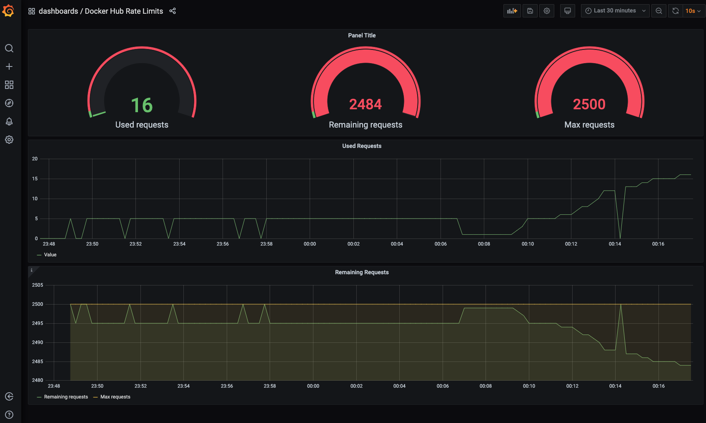

# Docker Hub Rate Limit Exporter for Prometheus

This exporter allows to retrieve the [Docker Hub rate limit counts](https://docs.docker.com/docker-hub/download-rate-limit/#how-can-i-check-my-current-rate) as scrape target for Prometheus.
The exporter obtains an auth token and then queries the Docker Hub registry with a HEAD request to parse `RateLimit-Limit`, `RateLimit-Remaining` and `RateLimit-Reset` into a Gauge metric.

You can use your [Docker Hub credentials](#docker-hub-authentication) to authenticate, otherwise an anonymous token is used.

## Demo

A demo environment with Grafana, Prometheus and the exporter is located in [example/docker-compose/](example/docker-compose/).



## Requirements

* Python 3 and libraries:
  * `requests`
  * `prometheus_client`

Preferred way is to use the `Dockerfile` to build your own image, pushed to your local container registry.

## Installation

### Docker

Build the image and push it to your container registry.

```shell
make docker
```

A full example with docker-compose running the exporter, Prometheus and Grafana is located in [example/docker-compose](example-compose).

```shell
cd example/docker-compose
docker-compose up -d
```

## Configuration

Set the following environment variables to control the behaviour:

```shell
DOCKERHUB_EXPORTER_PORT=8881
DOCKERHUB_EXPORTER_VERBOSE=1
```

### Docker Hub Authentication

```shell
export DOCKERHUB_USERNAME='xxx'
export DOCKERHUB_PASSWORD='xxx'
```


## Development

### Run in Foreground

```shell
pip3 install -r requirements.txt

$ python collectory.py
```

### Run in Docker

```shell
make docker
```

```shell
cd example/docker-compose
docker-compose up -d

docker-compose down

docker-compose up docker-hub-limit-exporter
```
